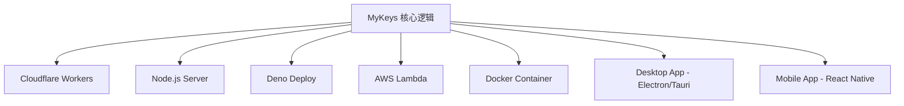

# MyKeys 项目技术架构分析

## 1. 项目概述

**MyKeys** 是一个基于 **Telegram Bot** 的个人密码管理工具，运行在 **Cloudflare Workers** 无服务器平台上。

| 属性 | 说明 |
|------|------|
| **项目类型** | Telegram Bot + Serverless |
| **运行平台** | Cloudflare Workers |
| **开发语言** | TypeScript |
| **数据存储** | Cloudflare D1 (SQLite) |
| **加密算法** | AES-256-GCM |
| **代码规模** | 单文件 ~361 行 |

---

## 2. 技术栈详解

### 2.1 运行时环境

```
Cloudflare Workers
├── 无服务器架构，按请求计费
├── 100,000 次/天免费请求
├── 边缘节点全球部署
└── 内置 Web Crypto API
```

### 2.2 数据存储 (D1)

- **类型**: Cloudflare D1 (SQLite 兼容)
- **表结构**:

```sql
-- 密码条目表
CREATE TABLE secrets (
  id INTEGER PRIMARY KEY AUTOINCREMENT,
  name TEXT NOT NULL,           -- 条目名称
  site TEXT DEFAULT '',         -- 网站/类型标识
  account TEXT DEFAULT '',      -- 加密的账号
  password TEXT DEFAULT '',     -- 加密的密码
  extra TEXT,                   -- 加密的备注
  expires_at DATE,              -- 到期日期
  created_at DATETIME DEFAULT CURRENT_TIMESTAMP
);

-- 会话状态表
CREATE TABLE sessions (
  user_id INTEGER PRIMARY KEY,  -- Telegram UID
  step TEXT,                    -- 当前流程步骤
  data TEXT,                    -- JSON 会话数据
  updated_at DATETIME
);
```

### 2.3 加密实现

| 组件 | 技术 |
|------|------|
| 算法 | AES-256-GCM |
| 密钥 | 32 字节，从环境变量派生 |
| IV | 12 字节随机生成 |
| 存储格式 | Base64(IV + Ciphertext) |

```typescript
// 加密流程
async function encrypt(text: string, secret: string): Promise<string> {
  const key = await getKey(secret);
  const iv = crypto.getRandomValues(new Uint8Array(12));
  const ct = await crypto.subtle.encrypt({ name: "AES-GCM", iv }, key, ...);
  return btoa(String.fromCharCode(...buf));  // IV + ciphertext
}
```

### 2.4 Telegram Bot API 集成

- **Webhook 模式**: 通过 HTTP POST 接收更新
- **消息类型处理**: 普通消息 + Inline Keyboard 回调
- **用户验证**: 单用户模式 (`ALLOWED_USER_ID`)

---

## 3. 核心功能模块

### 3.1 模块划分

```
src/index.ts
├── 加密模块 (L25-51)
│   ├── getKey()      - 密钥派生与缓存
│   ├── encrypt()     - AES-GCM 加密
│   └── decrypt()     - AES-GCM 解密
│
├── 工具函数 (L53-81)
│   ├── cleanText()   - 文本清洗
│   ├── parseDate()   - 日期解析
│   └── expiryInfo()  - 到期状态显示
│
├── 会话管理 (L83-91)
│   ├── getSession()  - 获取会话状态
│   ├── setSession()  - 更新会话
│   └── clearSession()- 清除会话
│
├── Telegram API (L93-109)
│   ├── tg()          - API 调用封装
│   ├── send()        - 发送消息
│   └── sendKb()      - 发送键盘消息
│
├── 主入口 (L112-162)
│   ├── fetch()       - HTTP 请求处理
│   └── scheduled()   - 定时任务 (到期提醒)
│
├── 消息处理 (L164-222)
│   └── handleMessage() - 命令与文本处理
│
├── 会话流程 (L224-258)
│   ├── handleFlow()  - 交互式输入流程
│   └── saveFinish()  - 保存完成处理
│
├── 回调处理 (L260-310)
│   └── handleCallback() - Inline 按钮回调
│
└── 列表/详情 (L312-360)
    ├── showList()    - 显示所有条目
    ├── showExpiring()- 显示即将到期
    ├── showDetail()  - 显示详情
    └── sendBackup()  - 发送备份文件
```

### 3.2 交互流程

```
用户发送名称 → ask_site → ask_account → ask_password → ask_expiry → ask_extra → 保存
     ↓
  会话超时 (5分钟) → 自动清除
```

### 3.3 定时任务

- **触发时间**: 每天 UTC 01:00 (北京时间 09:00)
- **功能**: 检查 7 天内到期的条目，发送提醒消息

---

## 4. 平台依赖分析

### 4.1 Cloudflare 专属依赖

| 依赖项 | 用途 | 替代方案 |
|--------|------|----------|
| **D1 Database** | 数据存储 | PostgreSQL / SQLite / MySQL |
| **Workers Runtime** | 运行环境 | Node.js / Deno / Bun |
| **Wrangler CLI** | 部署工具 | 其他部署方式 |
| **KV/Secrets** | 环境变量 | dotenv / 系统环境变量 |
| **Cron Triggers** | 定时任务 | node-cron / 系统 cron |
| **Web Crypto API** | 加密 | Node.js crypto (兼容) |

### 4.2 Telegram API 依赖

- Webhook 设置
- 消息发送 (sendMessage)
- 文档发送 (sendDocument)
- 内联键盘 (inline_keyboard)
- 回调查询 (callback_query)

---

## 5. 跨平台改造评估

### 5.1 可复用部分 (约 80%)

| 模块 | 复用性 | 说明 |
|------|--------|------|
| 加密逻辑 | ✅ 高 | Web Crypto API 标准化 |
| 业务逻辑 | ✅ 高 | 纯 TypeScript |
| 数据模型 | ✅ 高 | 标准 SQL |
| 工具函数 | ✅ 高 | 无平台依赖 |

### 5.2 需要适配的部分

| 模块 | 适配工作 | 难度 |
|------|----------|------|
| HTTP 入口 | 替换为 Express/Koa/Hono | 低 |
| 数据库层 | 抽象为 Repository 模式 | 中 |
| 环境配置 | 使用 dotenv 或配置文件 | 低 |
| 定时任务 | 使用 node-cron | 低 |

### 5.3 潜在目标平台



---

## 6. 改造建议

### 6.1 架构重构方向

1. **模块化拆分**: 将单文件拆分为独立模块
   ```
   src/
   ├── core/
   │   ├── crypto.ts      # 加密模块
   │   ├── storage.ts     # 存储抽象
   │   └── session.ts     # 会话管理
   ├── telegram/
   │   ├── handler.ts     # 消息处理
   │   └── api.ts         # Telegram API
   ├── adapters/
   │   ├── cloudflare.ts  # CF Workers 适配
   │   ├── node.ts        # Node.js 适配
   │   └── deno.ts        # Deno 适配
   └── index.ts
   ```

2. **依赖注入**: 将平台相关功能抽象为接口
   ```typescript
   interface IStorage {
     get(id: number): Promise<Secret | null>;
     save(secret: Secret): Promise<void>;
     search(keyword: string): Promise<Secret[]>;
   }
   
   interface INotifier {
     send(userId: string, message: string): Promise<void>;
   }
   ```

3. **配置分离**: 统一配置管理
   ```typescript
   interface Config {
     database: DatabaseConfig;
     telegram: TelegramConfig;
     encryption: EncryptionConfig;
   }
   ```

### 6.2 推荐改造步骤

| 阶段 | 内容 | 工作量 |
|------|------|--------|
| Phase 1 | 代码模块化拆分 | 2-3 天 |
| Phase 2 | 抽象存储层接口 | 1-2 天 |
| Phase 3 | 添加 Node.js 适配器 | 1 天 |
| Phase 4 | 添加测试用例 | 2-3 天 |
| Phase 5 | 支持其他平台 | 按需 |

---

## 7. 风险与注意事项

> [!CAUTION]
> **加密密钥不可变更**: 一旦 `ENCRYPT_KEY` 变更，所有已加密数据将无法解密。跨平台迁移时必须保持密钥一致。

> [!WARNING]
> **单用户设计**: 当前架构为单用户设计，如需多用户支持，需要重构用户认证和数据隔离机制。

> [!IMPORTANT]
> **Telegram 依赖**: 核心交互依赖 Telegram Bot API。若要支持其他消息平台（微信、Discord 等），需要抽象消息处理层。

---

## 8. 总结

MyKeys 项目架构清晰，代码简洁，具有良好的跨平台改造基础。主要改造工作集中在：

1. **解耦平台依赖** - 将 Cloudflare Workers 特定代码抽离
2. **模块化重构** - 拆分单文件为可维护的模块结构
3. **接口抽象** - 为存储、通知等核心功能定义抽象接口

预估整体改造工作量为 **1-2 周**，可在保持核心功能不变的情况下支持多平台部署。
